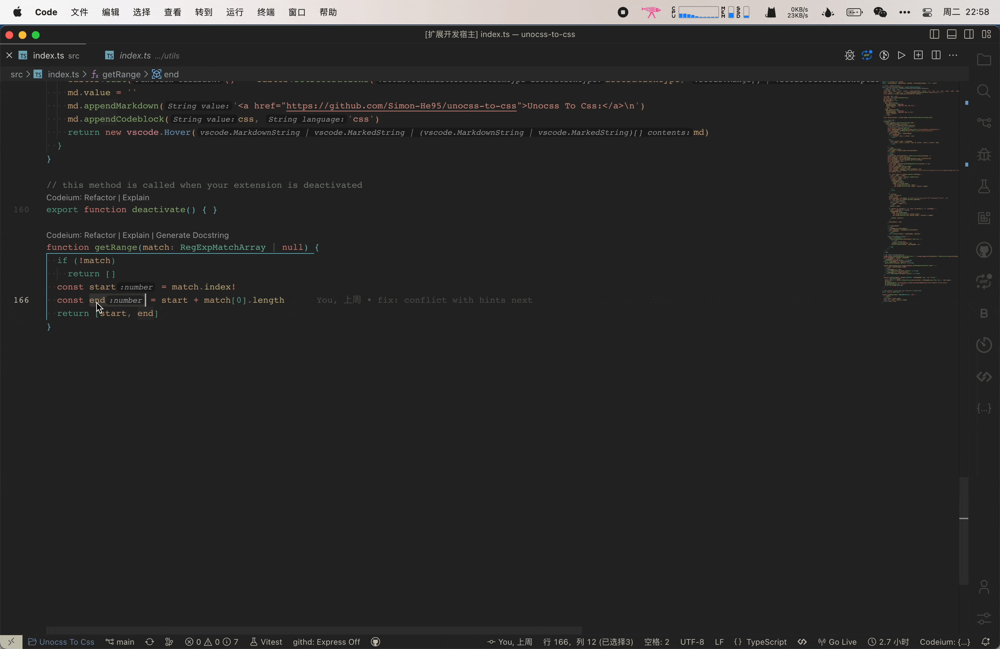

 <a href="./README.md">English</a> | 简体中文

快速生成 `console.log`, 通过 copy 多个变量，然后在空行使用 `ctrl+l` 既可以生成，带有编辑器 `文件名 + 行数 + 随机颜色的日志消息`

## 快捷键
- ctrl+l

## 新特性

- 支持了复制多个变量名，然后在空行使用 `ctrl+l`，生成包含多个变量名的log

## :coffee:

[请我喝一杯咖啡](https://github.com/Simon-He95/sponsor)

## License

[MIT](./license)
